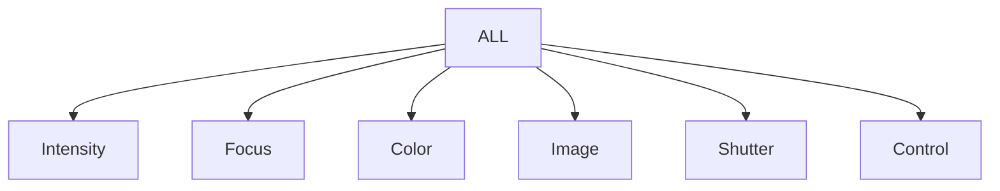

# ETC-EOS Parameters

A collection of ETC EOS fixture parameters. (_Versions: Eos 3.3.2 release, Fix-Lib 3.3.0.212_)

## Overview

| parameter_category | parameter_category_as_text | parameter_counts | status |
| ------------------ | -------------------------- | ---------------- | :----: |
| 1                  |  Intensity                 |  375             | ✅ |
| 2                  |  Focus	                    |  178             | ✅ |
| 3	                 |  Color	                    | 1680             | ✅ |
| 4	                 |  Image	                    |  808             | ✅ |
| 5	                 |  Form	                    | 1470             | ✅ |
| 6	                 |  Shutter                   |  134             | ✅ |
| 7	                 |  Control                   |	 144             | ✅ |

Sum : 4789


# Examples

##  Preview: [eos_parameters.csv](eos_parameters.csv)

|parameter_type|parameter_type_text_short|parameter_type_text_long|parameter_category|
|--------------|-------------------------|------------------------|------------------|
|1             |Intens                   |Intens                  |1                 |
|2             |Pan                      |Pan                     |2                 |
|3             |Tilt                     |Tilt                    |2                 |
|4             |Width                    |Width                   |6                 |
|5             |Height                   |Height                  |6                 |
|6             |Z                        |Z                       |3                 |
|7             |Hue                      |Hue                     |3                 |
|8             |Saturation               |Saturation              |3                 |
|9             |Cyan                     |Cyan                    |3                 |


## ASCII import

```txt
!!!!!!!!!!!!!!!!!!!!!!!!!!!!!!!!!!!!!!!!!!!!!!!!!!!!!!!!!!!!!!!!!!!!!!!!!!!!!!!
! Fixture Parameters
! $$ParamType Id, Cat, Short name, Long name
!    Id is the parameter type that appear in $$Param.
!    Cat is defined as follows: 1=Intensity, 2=Focus,
!    3=Color, 4=Image, 5=Form, 6=Shutter, 7=Control
 
$ParamType            1 1 Intens
   $$ShortName            Intens
$ParamType            2 2 Pan
   $$ShortName            Pan
$ParamType            3 2 Tilt
   $$ShortName            Tilt
```


```txt
!!!!!!!!!!!!!!!!!!!!!!!!!!!!!!!!!!!!!!!!!!!!!!!!!!!!!!!!!!!!!!!!!!!!!!!!!!!!!!!
! Fixture Personalities
! $Personality id
!    $$Manuf         Manufacturer name
!    $$Model         Model name
!    $$Dcid          Fixture DCID
!    $$SourceDcid    Fixture source DCID
!    $$HasRemoteDim  If fixture has a remote dimmer
!    $$Footprint     Fixture footprint
!    $$TotalFootprint Fixture footprint with all parts for multi-cell roots
!    $$Options       R=root P=part M=root mastered
!    $$RootPartOffset Offset from base address for root part parameters
!    $$PersChan:     Per channel data
!                    Parameter Number (see Fixture Parameter List for name),
!                    Parameter Size (1=8bit, 2=16bit),
!                    DMX offset (1-based.  If 16bit, offset of MSB),
!                    DMX offset (1-based) of 16bit LSB.
!                    Home Value(0-255 if 8bit, 0-65535 if 16bit)
!                    Flags for custom fixtures (S = Snap)
!     $$PersSlot:    Per channel slot data for custom fixtures
!                    Minimum DMX value
!                    Maximum DMX value
!                    Home DMX value
!                    Minimum user value
!                    Maximum user value
!                    Slot label if less than 20 chars
!     $$PersSlText:  Slot label if more than 20 chars
!     $$PersSlDcid:  Gel or gobo DCID for slot
!     $$PersPart:    Fixture part data
!                    DMX offset of part (1-based)
!                    Part DCID
!     $$PersPtText:  Part label
!     $$VirtualInt:  Fixture has a virtual intensity parameter
!     $$Notes        Fixture notes text
```


---



